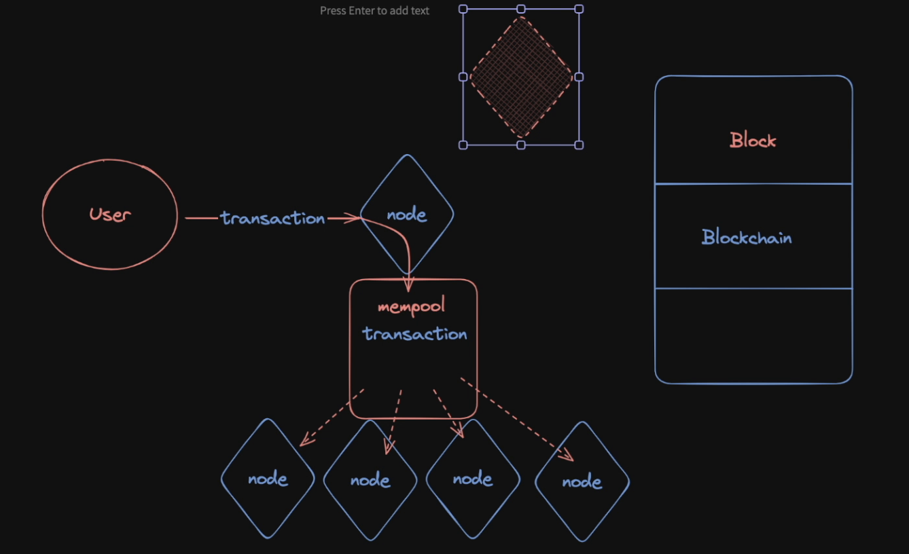
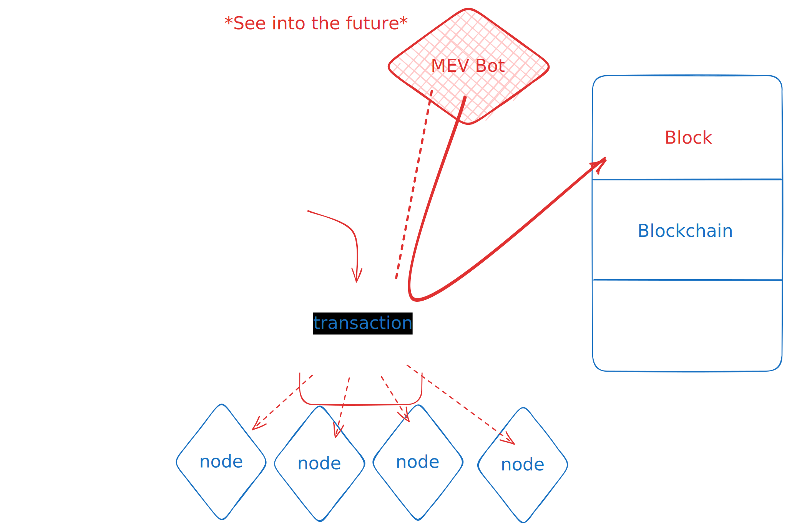
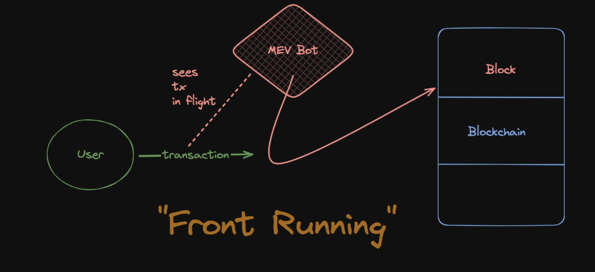

## What is MEV?

Mev stands for "Maximum Extractable Value", or sometimes "Miner Extractable Value", and it's the value that blockchain node operators and users can extract by ordering transactions in a block in a specific order.

There is a great resource [Flashbots.net](https://www.flashbots.net/)  research and development organization dedicated to counteracting the negative implications of MEV. Their ['New to MEV'](https://docs.flashbots.net/new-to-mev) page of their docs, in particular, is a fantastic learning resource.

## What is the mempool?


When a transaction is initiated it uses an RPC_URL, as we know. This URL points to a specific node on the blockchain which, instead of immediately integrating it into its block, places it into its 'memory pool', or 'mempool'. This constitutes the lower tier of workings that enable blockchain.



As we know, nodes essentially "take turns" building blocks for the blockchain. So if you send your transaction to a single node, the node will have to wait until it's that node's turn to include your transaction! This could take months!

So what the node does is accept your transaction, and add it to the `mempool`, accessible to other nodes. When another node sees this transaction waiting to be sent, it will pull transactions from the `mempool` to include in the block, often based on gas paid for that transaction.


>**Remember**: Part of gas paid serves as a financial incentive for node operators!


## Front-running

Suppose a malicious actor has visibility into the mempool and wants to use this to their advantage. Visibility into the mempool allows someone to effectively predict future transactions.

If a malicious actor were to see a transaction in this waiting room that would benefit them, they're able to send their own transaction, paying more gas, skipping the line.

The malicious actor's transaction would execute before the victims!



Take a loot at minimized visual representation of what MEV looks like. In specific, this kind of MEV is known as "front-running".



## Live working of MEV 

* [I DID (not) GET MEV'D BY FLASHBOTS!!](https://youtu.be/92bdU5uvsD8?si=tJN54MPw_KDkaM1X)

* [BLOCK MEV WITH A BOUNCER CONTRACT.... (maybe?)](https://youtu.be/MlbtSAntr7c?si=bufjUDRzf5o4RuOz)

* [sc-exploit-minimized--MEV](https://github.com/Cyfrin/sc-exploits-minimized)


## Again, What is MEV?

MEV - Maximum Extractable Value (Miner Extractable Value) - Both good and bad for the Ethereum Ecosystem, this concept exists in 4 forms

1. **Arbitrage** - this process is often handled by MEV bots. A difference in price between exchanges will be identified and MEV bots will balance the pools and their prices by leveraging swaps between them (and profiting along the way)

2. **Sandwiches** 

3. **Liquidations** - In the context of borrowing and lending protocols, bad debt needs to be accounted for quickly. Users which have failed to repay loans or if borrowed funds become undercollateralized may be liquidated by MEV bots

4. **JIT(Just In Time) Liquidity** - this is a type of attack or exploit where an MEV bot will identify a large transaction (borrow, swap etc) and will, just prior to this transaction, provide a bunch of liquidity to the protocol. This could have two effects:

   a. drastically impact the value of tokens being swapped

   b. rob other liquidity providers of fees, but swooping in then withdrawing their liquidity immediately after the transaction

There are two incredible articles covering MEV in great detail available on galaxy.com.

* [MEV: Maximal Extractable Value Pt. 1](https://www.galaxy.com/insights/research/mev-how-flashboys-became-flashbots/)

* [MEV: Maximal Extractable Value Pt. 2](https://www.galaxy.com/insights/research/mev-the-rise-of-the-builders/)

## Sandwich Attacks

`Sandwich Attacks` are similar in nature to `Just In Time (JIT)` liquidity exploits in that they both involve a `front run` and `back run` phase of the attack.

`Slippage protection` is a methodology which gives the user the ability to set a tolerance in the change of price of tokens in a transaction.

If a user is trading `2000 USDT for 1 ETH` (like in the diagram above), `slippage protection` would allow them to say "*I don't want to pay more than 2100 USDC for 1 ETH (5%), if the price changes by more than this, revert*".

Consideration like this allows users to control the impact MEV shenanigans will have on them.

## MEV Protections

1. **One way is to include any type of protection in the code itself.**   
Constructing the transaction in a manner that makes it harder for bots to gain useful knowledge. This might involve masking critical information or employing other strategic measures.   


*for example*, in any raffle when you are selecting a winner, before executing `select winner` function you can execute any function that will prevent refunding, so if any MEV bot sees that it is not the winner, it cannot refund the amount

2. **Private or Dark Mempool**

Another thing we can consider for defense is the use of a private or "dark" mempool, such as [Flashbots Protect](https://docs.flashbots.net/flashbots-protect/overview), [MEVBlocker](https://mevblocker.io/) or [Securerpc](https://securerpc.com/).

3. **Slippage Protection**

This is usually in the form of some minOutputAmount function parameter 

*for example:*  

```solidity
function swapExactInput(
        IERC20 inputToken,
        uint256 inputAmount,
        IERC20 outputToken,
        uint256 minOutputAmount,
        uint64 deadline
    ){...}
```

Leveraging a parameter like this allows the user to set their tolerance of price change during their transaction, limiting their exposure to sudden price fluctuations by MEV Exploits!


## Governance Attack - Introduction

`Governance attacks` are typically made through a governance proposal, generally with the intent of draining the protocol's liquidity.

This is in contrast to many other exploits where the mechanism of attack is more directly related to cryptography, or bugs in the code.

There are different types of Governance, such as:

* **Token Voting** - 1 token == 1 vote

* **allowlist** - 1 address == X votes

* **multisig** - X addresses

* **quadraticVoting** - # of people > # votes

A `governance attack` is then malicious action that is taken which exploits or leverages one of these `governance mechanisms`.

## How do Governance Attacks Work?
At first glance the steps of a `governance attack` seem pretty silly.

1. A malicious actor publishes a proposal which contains an action

   * this action could be any number of things from changing allow list addresses, to transferring tokens, code base changes etc

2. The Proposal is approved

   * this can be achieved by acquiring more voting power than is needed to pass the proposal, social engineering, or obfuscating what the proposed change is actually doing

3. The action is executed

4. The attack completed/funds stolen

You're encouraged to look into the cases of Yam Finance and Build.Finance for some eye opening examples of `governance attacks` in the wild.

## How do we Prevent Governance Attacks?
There are a few ways to mitigate the effects of governance attacks, but at their core, they're really a `people's problem`. Some ways to defend against these attacks may include:

* **Centralization of Power** - while not ideal in a Web3 ecosystem, this does solve the issue of control being democratically wielded through voting mechanisms.

* **Strategic Voting Power Distribution** - think carefully about who holds the most power over protocol governance, by strategic in assuring voting power is allotted to those invested and not made available to anyone with a flash loan

* **Guardian Buffer**- while this also sacrifices a degree of decentrality, this is an entity which serves as a buffer to vet proposals for malicious actions and assure pursued proposals are financially viable for the organization. This protects against governance attacks by filtering malicious proposals before they reach the voting stage

* **Gradual Decentralization** - Slowly opening up control allows a protocol to become better established in self management

* **Emergency Plan** - Emergency functionality or operating procedures should be in place. Knowing how to deal with emergency situations before they happen is the difference between putting out a stove fire and your house burning down
