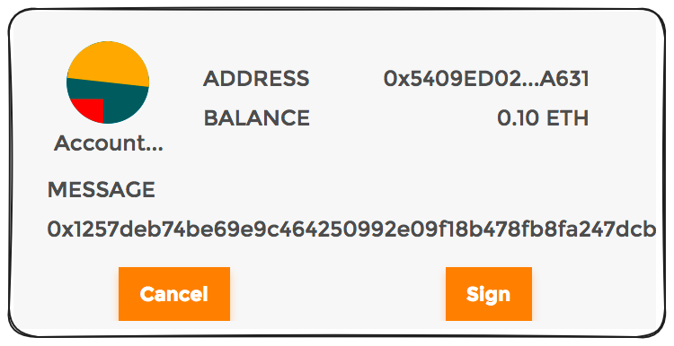
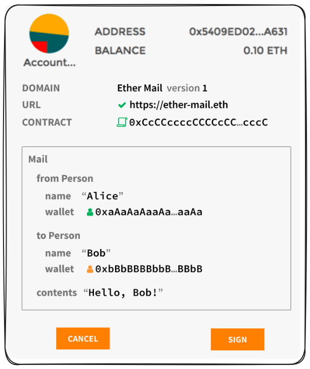

## Exploit – Unsupported Opcodes

Some smart contracts use inline `assembly` that relies on low-level EVM opcodes. However, not all of these opcodes are implemented the same way across different chains. For instance, while the `CREATE` opcode works on Ethereum (L1), it behaves differently on zkSync (L2), where contract deployment is handled through a system contract rather than the native opcode.

This difference can cause compatibility issues or unexpected behavior in contracts that use direct `CREATE` or `CREATE2` calls in assembly.

Learn more in the [zkSync EVM Differences documentation](https://docs.zksync.io/zksync-protocol/differences/evm-instructions)

## Some new librabries by OpenZepplin

* **Pausable** - Affords a protocol some emergency control. Adds modifiers such as whenPaused and whenNotPaused to control which functions can be called when. When paused, the configured parts of a contract will freeze.

* **ReentrancyGuard** - allows a protocol to set mutex locks on functions within a code base. A function is unlocked before being called, locked during an execution and unlocked again when an execution completes. This puts a practical barrier in the way of smart contracts trying to reenter a function before the last call has completed.

## Signature standard refresher:

[Improvement proposal](https://eips.ethereum.org/EIPS/eip-191)

### EIP-712 recap:

EIP-712 introduced a standardized way to handle hashing and signing typed and structured data.

In a practical sense this has transactions formatting data in such a way that rather than messages being a bytesstring, they could be parsed into meaningful, human readable information.

from this:



to this:



Example implementation of EIP 712: 

<details>
<summary>eip712hashing.sol</summary>

```solidity
pragma solidity ^0.4.24;

contract Example {
    struct EIP712Domain {
        string name;
        string version;
        uint256 chainId;
        address verifyingContract;
    }

    struct Person {
        string name;
        address wallet;
    }

    struct Mail {
        Person from;
        Person to;
        string contents;
    }

    bytes32 constant EIP712DOMAIN_TYPEHASH =
        keccak256("EIP712Domain(string name,string version,uint256 chainId,address verifyingContract)");

    bytes32 constant PERSON_TYPEHASH = keccak256("Person(string name,address wallet)");

    bytes32 constant MAIL_TYPEHASH =
        keccak256("Mail(Person from,Person to,string contents)Person(string name,address wallet)");

    bytes32 DOMAIN_SEPARATOR;

    constructor() public {
        DOMAIN_SEPARATOR = hash(
            EIP712Domain({
                name: "Ether Mail",
                version: "1",
                chainId: 1,
                // verifyingContract: this
                verifyingContract: 0xCcCCccccCCCCcCCCCCCcCcCccCcCCCcCcccccccC
            })
        );
    }

    function hash(EIP712Domain eip712Domain) internal pure returns (bytes32) {
        return keccak256(
            abi.encode(
                EIP712DOMAIN_TYPEHASH,
                keccak256(bytes(eip712Domain.name)),
                keccak256(bytes(eip712Domain.version)),
                eip712Domain.chainId,
                eip712Domain.verifyingContract
            )
        );
    }

    function hash(Person person) internal pure returns (bytes32) {
        return keccak256(abi.encode(PERSON_TYPEHASH, keccak256(bytes(person.name)), person.wallet));
    }

    function hash(Mail mail) internal pure returns (bytes32) {
        return keccak256(abi.encode(MAIL_TYPEHASH, hash(mail.from), hash(mail.to), keccak256(bytes(mail.contents))));
    }

    function verify(Mail mail, uint8 v, bytes32 r, bytes32 s) internal view returns (bool) {
        // Note: we need to use `encodePacked` here instead of `encode`.
        bytes32 digest = keccak256(abi.encodePacked("\x19\x01", DOMAIN_SEPARATOR, hash(mail)));
        return ecrecover(digest, v, r, s) == mail.from.wallet;
    }

    function test() public view returns (bool) {
        // Example signed message
        Mail memory mail = Mail({
            from: Person({name: "Cow", wallet: 0xCD2a3d9F938E13CD947Ec05AbC7FE734Df8DD826}),
            to: Person({name: "Bob", wallet: 0xbBbBBBBbbBBBbbbBbbBbbbbBBbBbbbbBbBbbBBbB}),
            contents: "Hello, Bob!"
        });

        uint8 v = 28;
        bytes32 r = 0x4355c47d63924e8a72e509b65029052eb6c299d53a04e167c5775fd466751c9d;
        bytes32 s = 0x07299936d304c153f6443dfa05f40ff007d72911b6f72307f996231605b91562;

        assert(DOMAIN_SEPARATOR == 0xf2cee375fa42b42143804025fc449deafd50cc031ca257e0b194a650a912090f);
        assert(hash(mail) == 0xc52c0ee5d84264471806290a3f2c4cecfc5490626bf912d01f240d7a274b371e);
        assert(verify(mail, v, r, s));
        return true;
    }
}
```

</details>

**Cheatcode alert: [deal](https://getfoundry.sh/reference/cheatcodes/deal/?highlight=deal#deal)**

```solidity
address alice = makeAddr("alice");
emit log_address(alice);
vm.deal(alice, 1 ether);
log_uint256(alice.balance); // 1000000000000000000
```

```solidity
address alice = makeAddr("alice");
emit log_address(alice);
deal(address(DAI), alice, 1 ether); // import StdUtils.sol first
log_uint256(address(DAI).balanceOf(alice)); // 1000000000000000000
```

## Exploit Signature Replay

[Remix example](https://remix.ethereum.org/#url=https://github.com/Cyfrin/sc-exploits-minimized/blob/main/src/signature-replay/SignatureReplay.sol&lang=en&optimize=false&runs=200&evmVersion=null&version=soljson-v0.8.20+commit.a1b79de6.js) in [sc-exploits-minimized](https://github.com/Cyfrin/sc-exploits-minimized) repo to assist you in better understanding this attack vector. Also [SignatureReplayTest.t.sol](https://github.com/Cyfrin/sc-exploits-minimized/blob/main/test/unit/SignatureReplayTest.t.sol) file in the sc-exploits-minimized. 


**Tool alert: [evmdiff](https://www.evmdiff.com/)** Allows you to directly compare two chains and clearly identify their differences. For example, Arbitrum One has a number of additional precompiles that aren't present on Ethereum. Another common difference between chains is op code support - Arbitrum, until recently, didn't support the PUSH0 op code!
