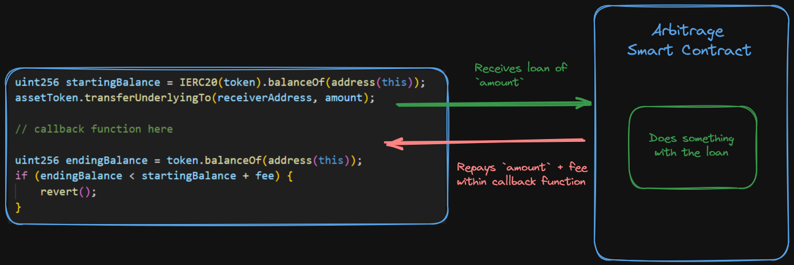
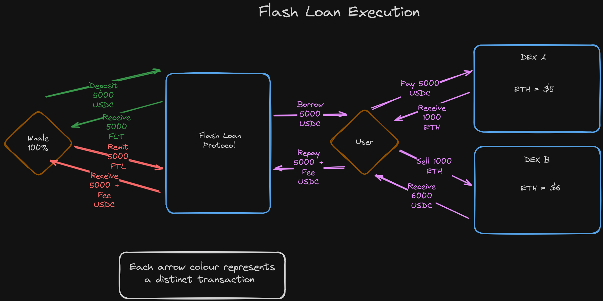

Audit of an upgradeable contract. Proxies and the like are very common in live scenarios so your experience assessing them here will be invaluable. Things we'll be covering include:

* [UUPS & Transparent](https://docs.openzeppelin.com/contracts/4.x/api/proxy)

* [Multi-facet Proxy (Diamond)](https://eips.ethereum.org/EIPS/eip-2535)

* [Foundry Proxies & Upgrades](https://github.com/Cyfrin/foundry-upgrades-f23)

* [What are upgradeable smart contracts?](https://www.youtube.com/watch?v=bdXJmWajZRY)

* [Upgradehub](https://upgradehub.xyz/) Allows you to view a history of changes during upgrades by entering a contract address

## Flashloan
A flash loan is a loan that exists for exactly 1 transaction. A user can borrow any amount of assets from the protocol as long as they pay it back in the same transaction. If they don't pay it back, the transaction reverts and the loan is cancelled.

A smart contract protocol assures that a flash loan is repaid effectively by containing logic within its loan functionality that requires the transferred balance be restored to the protocol within the same transaction as it's borrowed. If these checks don't pass, the transaction will revert, back to its initial state - as though the loan never took place.

The code for a flash loan may be as minimal as:

```solidity
​uint256 startingBalance = IERC20(token).balanceOf(address(this));
assetToken.transferUnderlyingTo(receiverAddress, amount);
​
// callback function here
​
uint256 endingBalance = token.balanceOf(address(this));
if (endingBalance < startingBalance + fee) {
    revert();
}
```



flashloan with example arbitrage:





## Slither

configuring `slither` by `slither.config.json`
You can customize your configuration file however you'd like, here is the example which includes several popular flags to toggle on or off based on circumstance.

```json
{
  "detectors_to_exclude": "conformance-to-solidity-naming-conventions,incorrect-versions-of-solidity",
  "exclude_informational": false,
  "exclude_low": false,
  "exclude_medium": false,
  "exclude_high": false,
  "disable_color": false,
  "filter_paths": "(mocks/|test/|script/|upgradedProtocol/)",
  "legacy_ast": false,
  "exclude_dependencies": true
}
```

